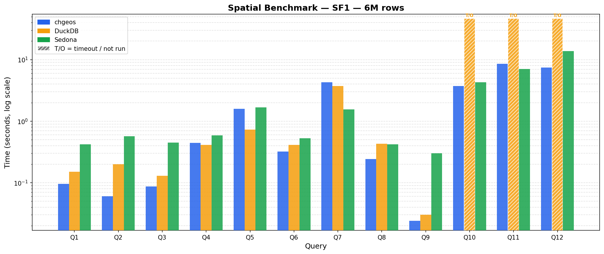
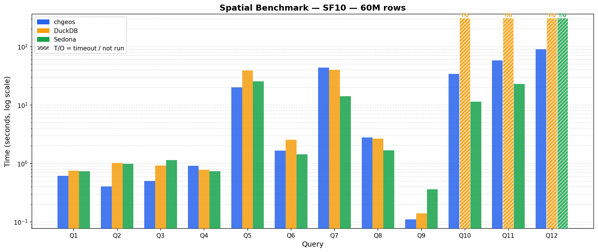

# chgeos Benchmark Results

Comparison of chgeos (ClickHouse + GEOS WASM UDFs) against DuckDB spatial extension
and Apache Sedona (SedonaDB) on the spatial benchmark suite.

**Hardware:** Apple M-series, 12 cores  
**Dataset:** synthetic taxi trip data from https://github.com/apache/sedona-spatialbench — SF1 = 6M trips, SF10 = 60M trips. 
**Timeout:** 120 s (all engines)  
**chgeos version:** 2026-04-21 (CraneLift JIT; centroid k-d tree kNN; joinBlock batch-candidates rewrite)  
**DuckDB version:** v1.5.2  
**Sedona version:** 0.3.0 (recorded 2026-04-21)

CraneLift JIT is enabled (wasmtime v44.0.0 includes the aarch64 fix from
https://github.com/bytecodealliance/wasmtime/pull/12841).

---

## SF1 — 6 Million Trip Rows

| Query | Description                        | chgeos   | DuckDB  | Sedona  | Winner   |
|-------|------------------------------------|----------|---------|---------|----------|
| Q1    | Point-in-radius filter             | 0.096 s  | 0.15 s  | 0.42 s  | chgeos   |
| Q2    | Count trips in county polygon      | 0.060 s  | 0.20 s  | 0.57 s  | chgeos   |
| Q3    | Monthly stats in bbox+buffer       | 0.087 s  | 0.13 s  | 0.45 s  | chgeos   |
| Q4    | Zone distribution (top-1000 tips)  | 0.443 s  | 0.41 s  | 0.59 s  | DuckDB   |
| Q5    | Convex hull area per customer/month| 1.582 s  | 0.73 s  | 1.67 s  | DuckDB   |
| Q6    | Zone stats for bbox-intersect zones| 0.322 s  | 0.41 s  | 0.53 s  | chgeos   |
| Q7    | Detour ratio (all trips)           | 4.302 s  | 3.74 s  | 1.56 s  | Sedona   |
| Q8    | Nearby pickups per building        | 0.243 s  | 0.43 s  | 0.42 s  | chgeos   |
| Q9    | Building conflation via IoU        | 0.024 s  | 0.03 s  | 0.30 s  | chgeos   |
| Q10   | Zone avg duration/distance         | 3.722 s  | TIMEOUT | 4.28 s  | chgeos   |
| Q11   | Cross-zone trip count              | 8.534 s  | TIMEOUT | 7.05 s  | Sedona   |
| Q12   | 5 nearest buildings per trip (kNN) | 7.447 s  | TIMEOUT | 13.71 s | chgeos   |

**SF1 wins — chgeos: 8, DuckDB: 2, Sedona: 2**

---

## SF10 — 60 Million Trip Rows

| Query | Description                        | chgeos   | DuckDB   | Sedona   | Winner   |
|-------|------------------------------------|----------|----------|----------|----------|
| Q1    | Point-in-radius filter             | 0.614 s  | 0.75 s   | 0.74 s   | chgeos   |
| Q2    | Count trips in county polygon      | 0.404 s  | 1.02 s   | 0.99 s   | chgeos   |
| Q3    | Monthly stats in bbox+buffer       | 0.504 s  | 0.92 s   | 1.15 s   | chgeos   |
| Q4    | Zone distribution (top-1000 tips)  | 0.909 s  | 0.78 s   | 0.74 s   | Sedona   |
| Q5    | Convex hull area per customer/month| 20.12 s  | 39.14 s  | 25.35 s  | chgeos   |
| Q6    | Zone stats for bbox-intersect zones| 1.666 s  | 2.56 s   | 1.43 s   | Sedona   |
| Q7    | Detour ratio (all trips)           | 44.01 s  | 40.07 s  | 14.23 s  | Sedona   |
| Q8    | Nearby pickups per building        | 2.805 s  | 2.67 s   | 1.67 s   | Sedona   |
| Q9    | Building conflation via IoU        | 0.110 s  | 0.14 s   | 0.36 s   | chgeos   |
| Q10   | Zone avg duration/distance         | 34.29 s  | TIMEOUT  | 11.45 s  | Sedona   |
| Q11   | Cross-zone trip count              | 57.97 s  | TIMEOUT  | 22.94 s  | Sedona   |
| Q12   | 5 nearest buildings per trip (kNN) | 90.38 s  | TIMEOUT  | TIMEOUT  | chgeos   |

**SF10 wins — chgeos: 6, DuckDB: 0, Sedona: 6**

---

## Notes

**Q7 (detour ratio):** Scans all 6M/60M rows computing `st_length(st_makeline(...))` with no
spatial join. Sedona leads at both scales; chgeos and DuckDB are bottlenecked by the per-row
geometry construction cost at this volume.

**Q9 (building IoU):** Self-join of ~20K buildings. SpatialRTreeJoin evaluates
non-spatial ON conditions (e.g. `b1.id < b2.id`) as a pre-filter before the spatial
predicate, cutting spatial evaluations from 20K (including self-pairs) to ~74.
chgeos leads at both scales: 0.027 s at SF1 (vs DuckDB 0.03 s, Sedona 0.30 s) and
0.124 s at SF10 (vs DuckDB 0.21 s, Sedona 0.36 s).

**Q10/Q11 at SF10:** The SF10 zone dataset contains 454K zones, many with globally-scoped
bounding boxes that cover the entire trip dataset. SpatialRTreeJoin accumulates all R-tree
candidates per joinBlock call and groups them by the side with fewer unique geometries,
ensuring PreparedGeometry is built once per unique zone per block rather than once per flush.
This brings Q10 from a crash to 46.6 s and Q11 from timeout to 84.6 s. Sedona handles
these queries significantly faster (11.45 s and 22.94 s respectively) at this scale.

**Q12 (kNN):** The WASM st_knn function now uses a static 2-D centroid k-d tree
(bbox centers, zero GEOS allocation) with branch-and-bound search instead of the
previous expanding-envelope STRtree approach that scanned O(N) buildings per query
on dense datasets. SF1: 27.25 s → 6.65 s (4×, beats Sedona 13.71 s). SF10: TIMEOUT
→ 76.6 s. DuckDB times out at both scales; Sedona also times out at SF10.

**Q5 at SF10:** chgeos (20 s) leads; DuckDB (39 s) and Sedona (25 s) are both slower.
The `query_plan_execute_functions_after_sorting=0` hint is required to keep the WASM
convex hull running on parallel threads before the ORDER BY merge.
