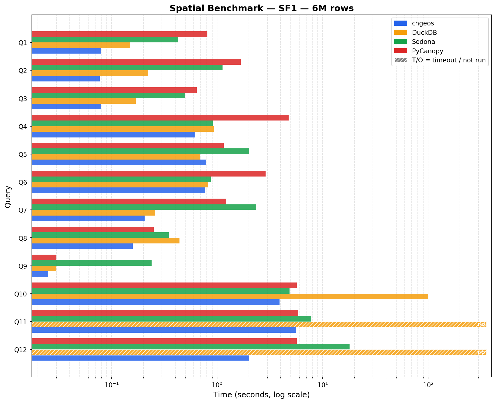
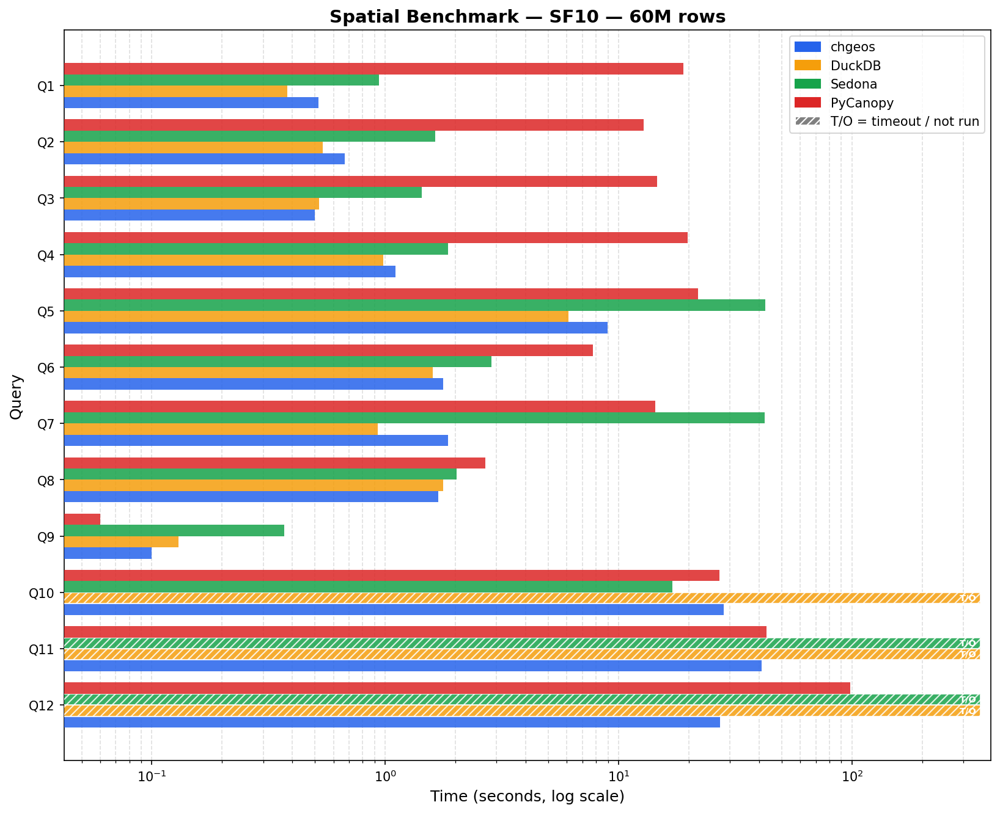

# chgeos Benchmark Results

Comparison of chgeos (ClickHouse + GEOS WASM UDFs) against DuckDB spatial extension,
Apache Sedona (SedonaDB) and PyCanopy on the spatial benchmark suite.

**Hardware:** AMD Ryzen 9 5900X, 128 GB RAM  
**Dataset:** synthetic taxi trip data from https://github.com/apache/sedona-spatialbench — SF1 = 6M trips, SF10 = 60M trips  
**Timeout:** 120 s (all engines)  
**chgeos version:** 2026-08-06  
**DuckDB version:** 1.5.2  
**Sedona version:** 0.3.0  
**PyCanopy:** measured 2026-07-29  
**Runs:** 5 per query (average reported)  
**Winner:** fastest engine; margins under 5% are reported as a tie

---

## SF1 — 6 Million Trip Rows

| Query | Description                        | chgeos   | DuckDB   | Sedona  | PyCanopy | Winner   |
|-------|------------------------------------|----------|----------|---------|----------|----------|
| Q1    | Point-in-radius filter             | 0.085 s  | 0.11 s   | 0.43 s  | 0.81 s   | chgeos   |
| Q2    | Count trips in county polygon      | 0.083 s  | 0.20 s   | 1.13 s  | 1.68 s   | chgeos   |
| Q3    | Monthly stats in bbox+buffer       | 0.083 s  | 0.16 s   | 0.50 s  | 0.64 s   | chgeos   |
| Q4    | Zone distribution (top-1000 tips)  | 0.657 s  | 0.67 s   | 0.91 s  | 4.78 s   | Tie      |
| Q5    | Convex hull area per customer/month| 0.869 s  | 0.82 s   | 2.00 s  | 1.16 s   | Tie      |
| Q6    | Zone stats for bbox-intersect zones| 0.829 s  | 0.97 s   | 0.87 s  | 2.88 s   | Tie      |
| Q7    | Detour ratio (all trips)           | 1.245 s  | 6.53 s   | 2.35 s  | 1.22 s   | Tie      |
| Q8    | Nearby pickups per building        | 0.162 s  | 0.46 s   | 0.35 s  | 0.25 s   | chgeos   |
| Q9    | Building conflation via IoU        | 0.026 s  | 0.03 s   | 0.24 s  | 0.03 s   | chgeos   |
| Q10   | Zone avg duration/distance         | 4.299 s  | TIMEOUT  | 4.87 s  | 5.70 s   | chgeos   |
| Q11   | Cross-zone trip count              | 6.049 s  | TIMEOUT  | 7.82 s  | 5.84 s   | Tie      |
| Q12   | 5 nearest buildings per trip (kNN) | 10.947 s | TIMEOUT  | 18.07 s | 5.71 s   | PyCanopy |

**SF1 wins — chgeos: 6, DuckDB: 0, Sedona: 0, PyCanopy: 1, Ties: 5**

---

## SF10 — 60 Million Trip Rows

| Query | Description                        | chgeos    | DuckDB   | Sedona   | PyCanopy | Winner   |
|-------|------------------------------------|-----------|----------|----------|----------|----------|
| Q1    | Point-in-radius filter             | 0.728 s   | 0.44 s   | 0.94 s   | 18.93 s  | DuckDB   |
| Q2    | Count trips in county polygon      | 0.915 s   | 0.70 s   | 1.64 s   | 12.81 s  | DuckDB   |
| Q3    | Monthly stats in bbox+buffer       | 0.731 s   | 0.54 s   | 1.43 s   | 14.59 s  | DuckDB   |
| Q4    | Zone distribution (top-1000 tips)  | 1.513 s   | 1.08 s   | 1.86 s   | 19.80 s  | DuckDB   |
| Q5    | Convex hull area per customer/month| 11.609 s  | 8.24 s   | 42.43 s  | 21.93 s  | DuckDB   |
| Q6    | Zone stats for bbox-intersect zones| 2.009 s   | 1.95 s   | 2.86 s   | 7.74 s   | Tie      |
| Q7    | Detour ratio (all trips)           | 11.992 s  | 68.31 s  | 42.28 s  | 14.39 s  | chgeos   |
| Q8    | Nearby pickups per building        | 1.843 s   | 2.19 s   | 2.02 s   | 2.69 s   | chgeos   |
| Q9    | Building conflation via IoU        | 0.111 s   | 0.16 s   | 0.37 s   | 0.06 s   | PyCanopy |
| Q10   | Zone avg duration/distance         | 33.376 s  | TIMEOUT  | 17.02 s  | 27.05 s  | Sedona   |
| Q11   | Cross-zone trip count              | 48.888 s  | TIMEOUT  | TIMEOUT  | 42.97 s  | PyCanopy |
| Q12   | 5 nearest buildings per trip (kNN) | 104.282 s | TIMEOUT  | TIMEOUT  | 98.60 s  | PyCanopy |

**SF10 wins — chgeos: 2, DuckDB: 5, Sedona: 1, PyCanopy: 3, Ties: 1**

The SF10 chgeos column was re-measured on 2026-08-06; competitor columns are from
2026-05-06 (DuckDB, Sedona) and 2026-07-29 (PyCanopy). Q1–Q4 are Parquet-I/O bound and
drift ±25% with machine state — two chgeos runs an hour apart the same day gave Q1 0.550 s
and 0.728 s. Treat the sub-2-second SF10 rows as indicative, not as a ranking.

---

## Notes

**Q5 (convex hull per customer):** The `query_plan_execute_functions_after_sorting=0`
hint is required to keep the WASM convex hull running on parallel threads before the
ORDER BY merge. Without it, ClickHouse defers the function to the single-threaded
post-sort stage, causing ~7× slowdown. Q5 also needs `max_bytes_ratio_before_external_group_by=0`
at SF10: it accumulates ~21 GiB across 3.1M groups, and the default ratio spills to disk at
0.5 × `max_server_memory_usage`, costing ~3.5 s. DuckDB leads at SF10 (8.24 s vs chgeos
11.6 s); PyCanopy is 22 s and Sedona 4× slower (42 s).

**Q7 (detour ratio):** Scans all rows computing `st_length(st_makeline(...))` with no
spatial join. WasmChainFusionPass fuses `st_makeline → st_length` into a single WASM
call, eliminating the intermediate WKB round-trip. chgeos leads DuckDB (68 s) and
Sedona (42 s) by a wide margin at SF10 (12.0 s); PyCanopy is the closest competitor (14.4 s),
and at SF1 the two are within 2% of each other.

**Q9 (building IoU):** Self-join of ~20K buildings. SpatialRTreeJoin evaluates
non-spatial ON conditions (e.g. `b1.id < b2.id`) as a pre-filter before the spatial
predicate, cutting candidate pairs dramatically. chgeos leads DuckDB and Sedona at both
scales, but PyCanopy is faster at SF10 (0.06 s vs 0.104 s).

**Q10 at SF10:** Sedona wins (17 s vs chgeos 33 s and PyCanopy 27 s, DuckDB TIMEOUT).
Sedona's DataFusion task-parallel build/probe model handles the large trip build side
more efficiently. DuckDB cannot complete within 120 s.

**Q11 at SF10:** Sedona times out because it materializes the intermediate
trip×pickup_zone result before applying the second zone join, causing memory explosion
at SF10. chgeos handles both zone joins in a single `SpatialRTreeDoubleJoin` pass
(48.9 s vs TIMEOUT for both DuckDB and Sedona). PyCanopy also completes, at 43.0 s.

**Q12 (kNN):** WASM `st_knn` uses a static 2-D centroid k-d tree with branch-and-bound
search. Both DuckDB and Sedona time out at SF10; chgeos completes in 104 s. PyCanopy
is the fastest engine on this query at both scales (5.7 s at SF1, 98.6 s at SF10) —
at SF1 chgeos is 1.9× slower, but that gap is a sort bottleneck rather than `st_knn`
itself, which accounts for well under a second of the total. At SF10 the two are within
6%. Note that Q12 sits close enough to the 120 s cap that a loaded machine can push it
over; measuring it needs `bench_sf.py --timeout 300`.
