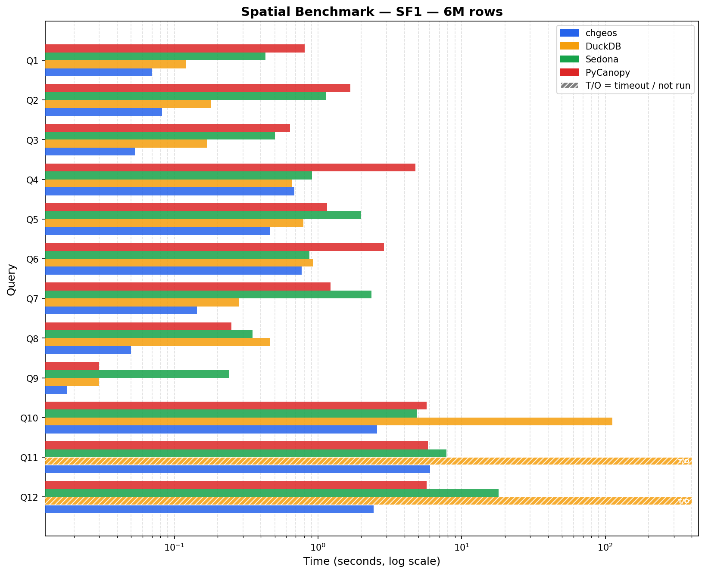
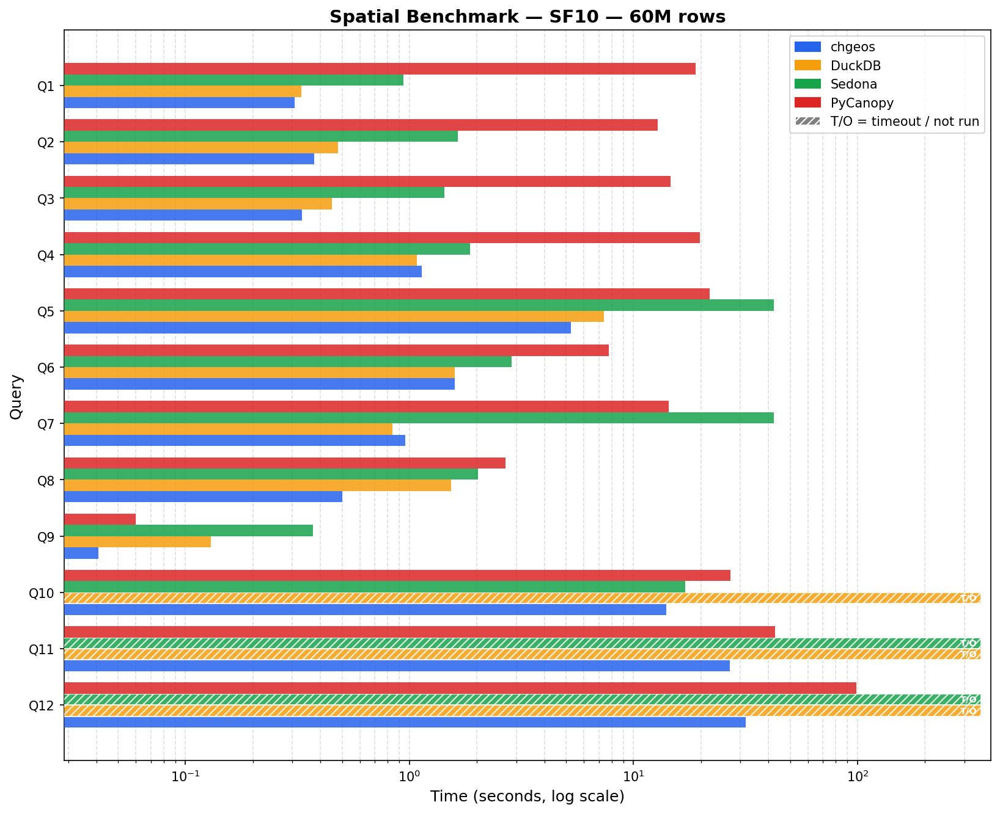
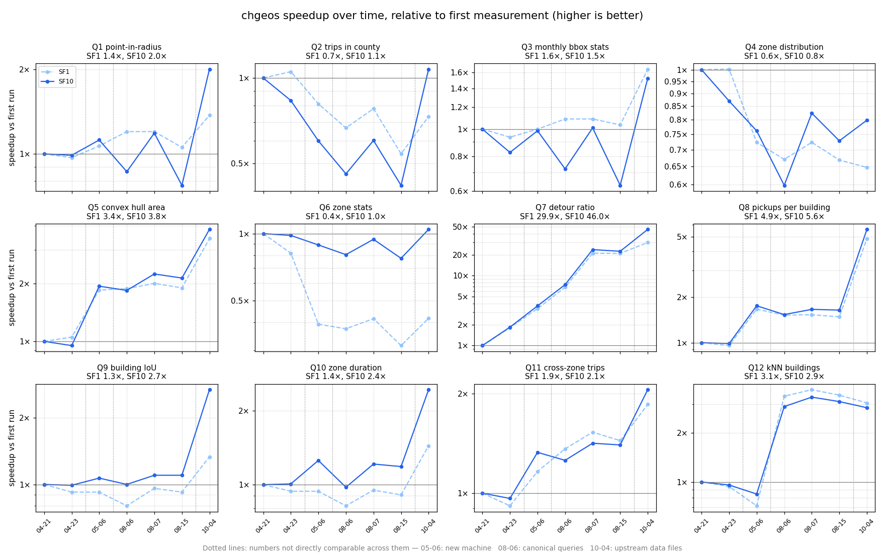

# chgeos Benchmark Results

Comparison of chgeos (ClickHouse + GEOS WASM UDFs) against DuckDB spatial extension,
Apache Sedona (SedonaDB) and PyCanopy on the spatial benchmark suite.

**Hardware:** AMD Ryzen 9 5900X, 128 GB RAM  
**Dataset:** synthetic taxi trip data from https://github.com/apache/sedona-spatialbench — SF1 = 6M trips, SF10 = 60M trips  
**Timeout:** 120 s (all engines)  
**chgeos version:** 2026-10-05 (CH `d2d24230309`, chgeos `f1fc30a`)  
**DuckDB version:** 1.5.6  
**SedonaDB version:** 0.4.1  
**PyCanopy version:** 0.4.1 (Polars 1.44.2)  
**Competitors measured:** 2026-10-04/05, same box and split Parquet files, via sedona-spatialbench `run_benchmark.py`, straight after the chgeos runs on an otherwise idle machine  
**Runs:** chgeos 3 per query, competitors 5 per query (average reported)  
**Winner:** fastest engine; margins under 5% are reported as a tie

---

## SF1 — 6 Million Trip Rows

| Query | Description                        | chgeos   | DuckDB   | Sedona  | PyCanopy | Winner   |
|-------|------------------------------------|----------|----------|---------|----------|----------|
| Q1    | Point-in-radius filter             | 0.05 s   | 0.12 s   | 0.15 s  | 0.28 s   | chgeos   |
| Q2    | Count trips in county polygon      | 0.06 s   | 0.18 s   | 0.68 s  | 0.23 s   | chgeos   |
| Q3    | Monthly stats in bbox+buffer       | 0.06 s   | 0.17 s   | 0.28 s  | 0.29 s   | chgeos   |
| Q4    | Zone distribution (top-1000 tips)  | 0.66 s   | 0.66 s   | 0.72 s  | 1.48 s   | Tie      |
| Q5    | Convex hull area per customer/month| 0.38 s   | 0.67 s   | 2.63 s  | 0.74 s   | chgeos   |
| Q6    | Zone stats for bbox-intersect zones| 0.63 s   | 0.83 s   | 0.70 s  | 1.50 s   | chgeos   |
| Q7    | Detour ratio (all trips)           | 0.13 s   | 0.27 s   | 0.53 s  | 0.53 s   | chgeos   |
| Q8    | Nearby pickups per building        | 0.04 s   | 0.45 s   | 0.16 s  | 0.27 s   | chgeos   |
| Q9    | Building conflation via IoU        | 0.02 s   | 0.03 s   | 0.03 s  | 0.03 s   | chgeos   |
| Q10   | Zone avg duration/distance         | 1.81 s   | 103.21 s | 2.44 s  | 2.20 s   | chgeos   |
| Q11   | Cross-zone trip count              | 3.40 s   | TIMEOUT  | 3.99 s  | 2.47 s   | PyCanopy |
| Q12   | 5 nearest buildings per trip (kNN) | 1.61 s   | TIMEOUT  | 3.19 s  | 1.74 s   | chgeos   |

**SF1 wins — chgeos: 10, DuckDB: 0, Sedona: 0, PyCanopy: 1, Ties: 1**

Q4 is dominated by reading `zone.parquet`, which is the same file at every scale factor, so SF1
and SF10 Q4 land close together (0.66 s / 0.97 s).

**The SF1 tally understates DuckDB, and the cause is the upstream Parquet layout.** The SF1
trip table (`sf1/trip/*.parquet`, 2 files) holds 6M rows in only 4 row groups. DuckDB caps a
scan pipeline's thread count at the number of row groups in the file — the row group is its
atomic unit of scan parallelism, with no sub-splitting — so DuckDB ran these queries on at most
4 of the machine's 24 threads. At SF10 the 15 trip files hold 45 row groups, enough for full
parallelism, which is most of why its SF1→SF10 curve looks sublinear. ClickHouse has no
equivalent limit: its Parquet reader splits row groups into subgroups and is at full
parallelism at both scales. Several SF1 rows, particularly the sub-second Q1–Q3, are therefore
partly measuring DuckDB's row-group cap rather than chgeos being faster, and DuckDB would
likely take some of them on files with smaller row groups. We cannot say how many: two scale
factors are not enough to separate the thread cap from DuckDB's fixed per-query overhead
(~0.15 s, versus roughly zero for chgeos), and the two models do not predict the same SF10 times.
Until the upstream data has smaller row groups, **treat SF10 as the primary comparison.** The
SF10 Q7 gap is not explained by this — see the Q7 note below.

---

## SF10 — 60 Million Trip Rows

| Query | Description                        | chgeos    | DuckDB   | Sedona   | PyCanopy | Winner   |
|-------|------------------------------------|-----------|----------|----------|----------|----------|
| Q1    | Point-in-radius filter             | 0.27 s    | 0.32 s   | 0.62 s   | 2.23 s   | chgeos   |
| Q2    | Count trips in county polygon      | 0.31 s    | 0.47 s   | 1.36 s   | 2.02 s   | chgeos   |
| Q3    | Monthly stats in bbox+buffer       | 0.27 s    | 0.44 s   | 1.04 s   | 2.89 s   | chgeos   |
| Q4    | Zone distribution (top-1000 tips)  | 0.97 s    | 1.02 s   | 1.77 s   | 5.39 s   | chgeos   |
| Q5    | Convex hull area per customer/month| 4.86 s    | 6.54 s   | 20.87 s  | 8.63 s   | chgeos   |
| Q6    | Zone stats for bbox-intersect zones| 1.50 s    | 1.51 s   | 2.05 s   | 6.37 s   | Tie      |
| Q7    | Detour ratio (all trips)           | 0.91 s    | 0.81 s   | 1.92 s   | 7.07 s   | DuckDB   |
| Q8    | Nearby pickups per building        | 0.46 s    | 1.50 s   | 1.37 s   | 3.32 s   | chgeos   |
| Q9    | Building conflation via IoU        | 0.03 s    | 0.13 s   | 0.05 s   | 0.06 s   | chgeos   |
| Q10   | Zone avg duration/distance         | 8.00 s    | TIMEOUT  | 14.32 s  | 21.09 s  | chgeos   |
| Q11   | Cross-zone trip count              | 14.32 s   | TIMEOUT  | 29.98 s  | 15.86 s  | chgeos   |
| Q12   | 5 nearest buildings per trip (kNN) | 19.16 s   | TIMEOUT  | 36.37 s  | 19.45 s  | Tie      |

**SF10 wins — chgeos: 9, DuckDB: 1, Sedona: 0, PyCanopy: 0, Ties: 2**

chgeos SF1 and SF10 were re-measured on 2026-10-05 at CH `d2d24230309` (3 runs, averages; load
~17 at start, so chgeos is if anything understated). All 12 queries match the spatialbench
answers at both scales. Competitors are from the 2026-10-04/05 idle run (5 runs, 120 s
timeout).

Q10–Q12 since 2026-10-04 (SF10: Q10 14.1 → 8.0 s, Q11 25.7 → 14.3 s, Q12 32.5 → 19.2 s):
- `SpatialRTreeJoin`: Hilbert-packed static R-tree (build 2.4 → 1.3 s for 60M trips), heavy
  probe rows evaluated on a shared pool, prefetched column-wise gathers;
- `st_knn`: index cached across calls, candidates refined in distance order with early exit.

Q10 and Q11 got 2× faster since 2026-10-03 (Q10 30.0 → 14.1 s, Q11 45.6 → 25.7 s), all from
host-side work in `SpatialRTreeJoin`, not WASM:
- predicate evaluation groups candidates by left-row runs, resolves column pointers once per
  probe block and copies only the columns the predicate reads (`77700fc9f0a`, `95fbe4909e6`);
  the large-row path for zones with millions of candidate trips was still looking every column
  up by name per candidate, which was ~31% of Q10's straggler tail;
- the per-core R-tree sub-trees are now spatially disjoint (kd bisection on box centres) for
  build sides up to 10M rows (`08e9f5beba7`), so a probe only descends the trees it can touch.
  Q11's second join (31M rows probing the zone tree) is where this pays: CPU −24%. Above 10M
  rows (the 60M-trip build of Q10/Q11's first join) the same partitioning lost parallelism and
  is not used.

What moved since 2026-10-03: a host-side bounding-box prefilter answers bbox-disjoint
rows of constant-argument spatial predicates without entering WASM (Q1 −29%, Q3 −30%,
Q2/Q6 −7..12%), and an occupancy grid in `SpatialRTreeJoin` skips probe rows whose box
touches no build-side cell (Q8 1.45 → 0.51 s). Q4 and Q6 are now Parquet-read bound
(Q6 = zone scan 0.86 s + trip scan 0.88 s; the join itself is ~0). Q7 is the remaining
DuckDB lead: Parquet read alone is ~0.73 s, the rest is copying WKB into WASM.
The 2026-08-07 description that follows is kept for history.

Both chgeos columns were re-measured on 2026-08-07 on an idle machine at commit
`79063df`, and every query was checked against the spatialbench reference answers
first (SF1 and SF10 both 12/12). Only Q7 moved by more than the noise floor:
0.45 → 0.21 s at SF1 and 3.95 → 1.86 s at SF10, both from the flat-geometry chain
path described in the Q7 note. Every other query landed within its own run-to-run
width of the 2026-08-06 measurement, including Q5, which changed aggregation
strategy — see the Q5 note. Repeat spreads on this run were at most 1.2× between
the fastest and slowest of the 5 runs, so the sub-second rows are tighter than
usual; they are still Parquet-I/O bound and still drift ±25% across machine
states. The Q3, Q8 and Q11 ties are all under 5%, and Q3 and Q11 flipped from a
DuckDB and a PyCanopy win purely on that margin.
Competitor columns are re-measured on 2026-10-04/05 (DuckDB 1.5.6, SedonaDB 0.4.1, PyCanopy 0.4.1).
Treat the sub-2-second SF10 rows as indicative, not as a ranking.

### chgeos over time

Generated by `scripts/plot_history.py` from the git history of `benchmark_results.json`
(last measurement per day), shown as speedup relative to each query's first measurement.
Values below 1× on Q4 and Q6 come from data and machine changes, not from chgeos: both
queries read the full zone file (now 156k worldwide zones), and DuckDB slowed by the same
factor on Q4 over the same period (SF1 1.71×, SF10 1.26×), so the chgeos/DuckDB ratio is
unchanged. Dotted lines mark points where
numbers are not directly comparable: a new machine (05-06), the corrected canonical queries (08-06, which changed
Q12's meaning) and the switch to the upstream split data files (10-04).

---

## Notes

**Q5 (convex hull per customer):** The `query_plan_execute_functions_after_sorting=0`
hint is required to keep the WASM convex hull running on parallel threads before the
ORDER BY merge. Without it, ClickHouse defers the function to the single-threaded
post-sort stage, causing ~7× slowdown. Q5 also needs `max_bytes_ratio_before_external_group_by=0`
at SF10: it accumulates ~15 GiB across 3.1M groups, and the default ratio spills to disk at
0.5 × `max_server_memory_usage`, costing ~3.5 s. chgeos leads at both scales (0.39 s vs DuckDB 0.67 s and PyCanopy 0.74 s at SF1,
5.14 s vs DuckDB 6.54 s at SF10); PyCanopy is 8.63 s and SedonaDB 20.9 s at SF10.

`st_collect_agg` can be registered either as a plain WASM UDF fed by `groupArray`, or as a
native aggregate via `SETTINGS is_aggregate = 1`, which accumulates rows into arena nodes
and skips building the intermediate array. Measured head to head on this query, the
`groupArray` form wins at both scales — 0.79 s vs 1.09 s at SF1 and 8.95 s vs 10.82 s at
SF10 — for 0.1–0.5 GiB more peak memory, so `st_collect_agg` dropped the setting in commit
`79063df`. The other four `*_agg` functions keep it.

**Q7 (detour ratio):** Scans all rows computing `st_length(st_makeline(...))` with no
spatial join. WasmChainFusionPass fuses `st_makeline → st_length` into a single WASM
call, eliminating the intermediate WKB round-trip. That is enough to beat SedonaDB (0.53 s /
1.92 s) and PyCanopy (0.53 s / 7.07 s) at both scales, and the flat path below it
also takes SF1 from DuckDB — 0.14 s vs 0.27 s. DuckDB still wins SF10, 0.81 s vs
0.92 s. DuckDB 1.5.2 needed 6.53 s / 68.3 s here, so most of that engine's position is a
25× / 73× improvement on its own side, not a chgeos regression. The remaining SF10 gap is
the largest against chgeos in the suite, and unlike the SF1 rows above it is not an
artifact of the file layout.

Reading the DuckDB sources explains the remainder: DuckDB does not use GEOS for this
query at all. Its `sgl` geometry layer treats a deserialized POINT as a pointer into the
Parquet blob with no copy and no allocation, builds the `ST_MakeLine` result in a stack
buffer, and computes `ST_Length` as a plain loop over the vertex array. GEOS is a separate
module reserved for real topology (`ST_Intersects`, `ST_Within`, `ST_Contains`). chgeos
instead parses WKB into a GEOS geometry tree for every row.

Most of that cost turned out to be ours rather than GEOS's, and it came off in two steps.
First, `read_wkb` was constructing a `GeometryFactory` and a `WKBReader` on every call, and
Q7 calls it twice per row — 12M reader constructions at SF1, 120M at SF10. Hoisting both to
statics over the shared default factory (commit `ea6c42c`) cut Q7 by 29% / 33%.

Second, the chain machinery grew a non-GEOS currency. Alongside `Geometry`, a chain can pass
a `FlatBatch` between stages: one contiguous `xy` array with ring and row offset arrays, no
per-row allocation and no geometry tree. `st_makeline` builds one straight from the two WKB
points and `st_length` sums vertex runs out of it, so the fused Q7 chain now runs end to end
without entering GEOS. A stage joins the flat path only if it can produce bit-identical
output, NaN handling and accumulation order included; anything that cannot declines the block
and GEOS runs it, which is why the reference answers are unchanged. That took Q7 from 0.45 s
to 0.21 s at SF1 and 3.95 s to 1.86 s at SF10.

Marginal cost per million rows is now 0.031 s for chgeos against 0.012 s for DuckDB, a 2.5×
gap — down from 5.2× after the hoist and 7.9× before it, and approaching the 1.2–2.0× seen
on the filter-dominated Q1–Q3. What remains is the WKB parse itself, which the flat path
still performs per row while DuckDB reads points in place out of the Parquet blob.

**Q9 (building IoU):** Self-join of ~20K buildings. SpatialRTreeJoin evaluates
non-spatial ON conditions (e.g. `b1.id < b2.id`) as a pre-filter before the spatial
predicate, cutting candidate pairs dramatically. All engines land at or below 0.13 s, near the
resolution of these measurements; chgeos is 0.02 s / 0.04 s against SedonaDB 0.03 s / 0.05 s
and PyCanopy 0.03 s / 0.06 s.

**Q10:** chgeos wins at both scales; DuckDB times out at SF10.

**Q11 (cross-zone trips):** chgeos uses the plan PyCanopy hand-codes
(`bench/spatial_bench/queries/q11.py`): two independent spatial joins for pickup and dropoff
zone, matched on `t_tripkey`. The spatialbench SQL chains the second join onto the first; the
answer is identical. PyCanopy still wins SF1 (2.47 s vs 3.40 s); chgeos wins SF10. DuckDB times
out.

**Q12 (kNN):** WASM `st_knn` selects candidates from a centroid k-d tree, then refines them to
exact point-to-geometry distance over coordinates flattened at index build (no per-row GEOS
parse). chgeos wins SF1 and ties PyCanopy at SF10; DuckDB times out.
